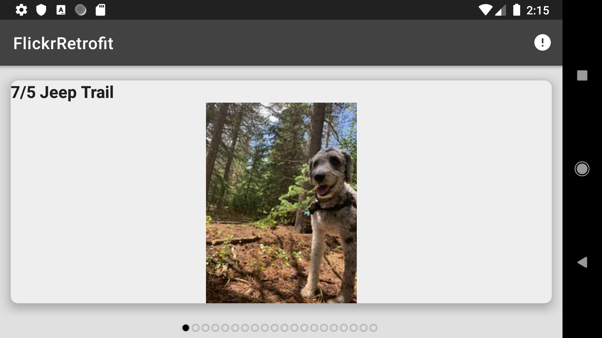

# FlickrRetrofit

Technical Project that parses Flickr images from the public JSON stream using Retrofit and loads it to the ViewPager.

# Build and Libraries

  - Compile SDK Version: 28
  - Min SDK Version: 21

	##### retrofit dependency
  
	-`implementation 'com.squareup.retrofit2:retrofit:2.5.0'`

	-`implementation 'com.squareup.retrofit2:converter-gson:2.4.0'`

	##### dependency for CardView
  
	-`implementation 'androidx.cardview:cardview:1.0.0'`

	##### dependency for picasso (image downloading library)
  
	-`implementation 'com.squareup.picasso:picasso:2.71828'`

	-`implementation 'com.github.JakeWharton:ViewPagerIndicator:2.4.1'`

	##### dependency for Material Components
  
	-`implementation 'com.google.android.material:material:1.1.0-alpha07'`

	##### dependency for Android ViewModel
  
	-`implementation "android.arch.lifecycle:extensions:1.1.1"`
  
	-`implementation "android.arch.lifecycle:viewmodel:1.1.1"`

	##### dependency for oss-licenses
  
	-`implementation 'com.google.android.gms:play-services-oss-licenses:17.0.0'`
  
  
# Screenshots

